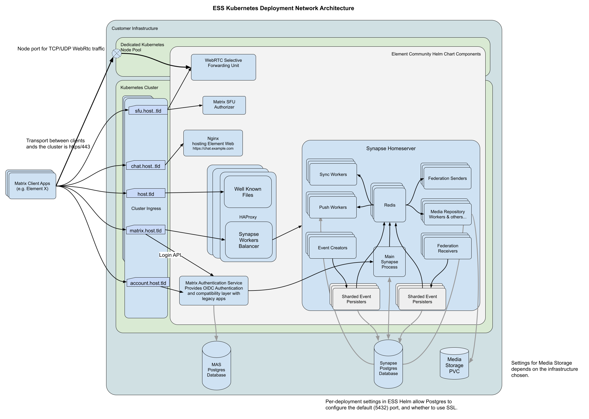

<!--
Copyright 2025 New Vector Ltd

SPDX-License-Identifier: AGPL-3.0-only
-->

# Architecture

## Overview

Element Server Suite Community is a collection of components that are used to build a Matrix homeserver. The following diagram shows the main components and their relationships. `host.tld` is an example Homeserver server name, but you can change it to any other domain name you want.

### Element Web Client

The web client is an open source project, which can be found [here](https://github.com/element-hq/element-web). It provides the web chat interface of your deployment. It is preconfigured to use your local homeserver.

### Synapse Server

Synapse is a Matrix homeserver. It provides the core functionality of a Matrix server and handles all communication between users. Its source code can be found [here](https://github.com/element-hq/synapse).

Synapse can be deployed as a multiple-workers deployment. Adding specialized workers will offload processes and traffic from the main process, and allow to handle more users without compromising performance. See the [Synapse Workers documentation](https://github.com/element-hq/synapse/blob/develop/docs/workers.md) for more informations.

### Redis Pub/Sub

Redis Pub/Sub allows Synapse to broadcast events between Synapse workers.

### HAproxy

HAProxy offers 2 features :
- Distributing Matrix APIs traffic across Synapse workers and Matrix Authentication Service
- Serving `/.well-known/matrix` & `/.well-known/element` files

HAProxy appears ready only after some key Synapse processes are ready. This should ensure that the deployment appears ready only after it can actually serve clients traffic.

### PostgreSQL Database

PostgreSQL is used as our primary storage backend. It stores user profiles, room state, messages and other metadata required to run the server. The Chart does provide its own PostgreSQL Database by default, but in a production deployment it should be configured to use an external database instead. Backups are the responsibility of the user.

### Matrix Authentication Service (MAS)

Matrix Authentication Service provides the future OIDC-Based matrix authentication. It is enabled by default, allowing users to authenticate with the most recent clients.

### Element Call and Livekit SFU (Not available in the chart yet)

Element Call and Livekit SFU will provide Matrix VOiP calls. It will allow users to make video calls between each other using their Matrix accounts.

## Chart Features

The chart provides additional features on top of this deployment, to help you deploy a production-ready Synapse server:

### Cert Manager Integration

If you have [Cert-Manager](https://cert-manager.io/) installed in your cluster, you can configure your clusterIssuer in the chart values file. it will automatically provision certificates for the deployed services. You can override this behaviour locally for each component ingress.

### Service Monitors Integration

If you have [Prometheus Operator](https://github.com/prometheus-operator/prometheus-operator) installed in your cluster, the chart will automatically create the relevant ServiceMonitorsYou can override this behaviour locally for each component.

### Synapse Check Config Hook

The Chart provides a check-config hook that runs synapse's `synapse.config` command to ensure that all configuration is valid before applying the changes. This ensures that any changes made to the config are caught early on, and can be fixed before they cause issues in production.

### Init Secrets Hook

Init secrets allows the chart to generate random passwords with a Helm Hook without having to generate them beforehand. For a production deployment, you should save the generated secret somewhere to be able to recover it if needed.

